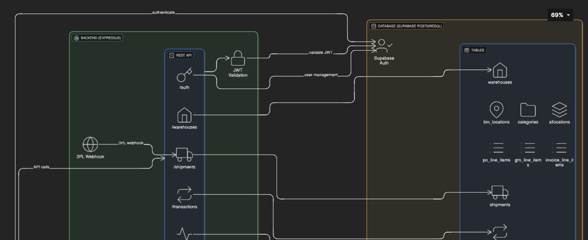
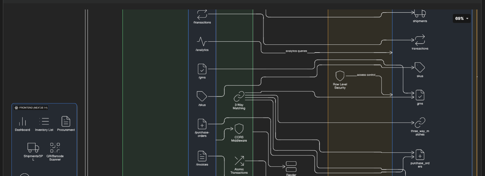
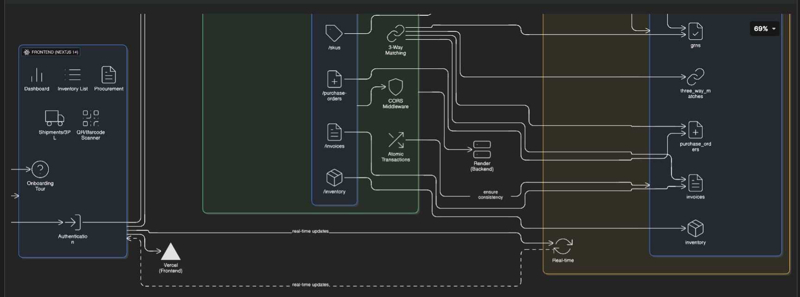

# Insyd Inventory Solution

> A unified inventory management system for AEC (Architecture, Engineering, and Construction) material businesses. Built with NextJS + ExpressJS stack to eliminate data latency and enable real-time inventory visibility.

## Live Demo

- **Frontend (App)**: [https://insyd-inventory-solution.vercel.app](https://insyd-inventory-solution.vercel.app)
- **Backend (API)**: [https://insyd-inventory-api.onrender.com/api](https://insyd-inventory-api.onrender.com/api)
- **Database**: Supabase PostgreSQL (Cloud)
- **GitHub Repository**: [https://github.com/akshatsinha0/insyd-inventory-solution](https://github.com/akshatsinha0/insyd-inventory-solution)

## Screenshots (using eraser.io)







---

## Problem Statement

Indian AEC material businesses face critical challenges:
- **Data Latency**: 24-48hr lag between physical movement and digital records
- **Overselling**: No concurrency control leads to inventory deficits
- **Phantom Inventory**: Poor SKU granularity causes materials to be "lost" digitally
- **Black Box Logistics**: No visibility into in-transit inventory

## Solution Architecture

```
┌─────────────────┐     ┌─────────────────┐     ┌─────────────────┐
│   NextJS PWA    │────▶│  ExpressJS API  │────▶│    Supabase     │
│  (Mobile-First) │     │  (REST + ACID)  │     │  (PostgreSQL)   │
└─────────────────┘     └─────────────────┘     └─────────────────┘
```

## Tech Stack

- **Frontend**: NextJS 14 (App Router), TailwindCSS
- **Backend**: ExpressJS, Node.js
- **Database**: Supabase (PostgreSQL)
- **Authentication**: Supabase Auth

## Features

- [x] Real-time inventory tracking
- [x] ABC categorization (High/Medium/Low value)
- [x] Soft allocation with atomic transactions
- [x] Bin location mapping (WH-ASL-RK-BN format)
- [x] QR/Barcode scanning simulation
- [x] Transaction audit logging
- [x] Dead stock alerts
- [x] Multi-warehouse support
- [x] 3PL shipment tracking with ASN
- [x] Webhook integration for logistics providers
- [x] In-transit inventory visibility
- [x] Purchase Order management
- [x] Goods Received Note (GRN) processing
- [x] Supplier invoice entry
- [x] Automated 3-way matching (PO vs GRN vs Invoice)
- [x] Variance detection and approval workflows

## Project Structure

```
insyd-inventory-solution/
├── client/                 # NextJS frontend
│   ├── app/               # App router pages
│   ├── components/        # React components (modular, SOLID-compliant)
│   └── lib/               # Utilities
├── server/                # ExpressJS backend
│   ├── routes/            # API routes
│   └── lib/               # Supabase client
└── database/              # PostgreSQL schema & seed data
```

## Getting Started

### Prerequisites
- Node.js 18+
- npm or yarn
- Supabase account

### Installation

```bash
# Clone repository
git clone https://github.com/akshatsinha0/insyd-inventory-solution.git

# Install client dependencies
cd client && npm install

# Install server dependencies
cd ../server && npm install

# Set up environment variables
cp .env.example .env
```

### Environment Variables

```env
# Supabase
NEXT_PUBLIC_SUPABASE_URL=your_supabase_url
NEXT_PUBLIC_SUPABASE_ANON_KEY=your_anon_key
SUPABASE_SERVICE_ROLE_KEY=your_service_key

# Server
PORT=3001
NODE_ENV=development
```

---

## API Documentation

### Overview: How APIs Solve Real AEC Business Problems

This API suite addresses the core pain points of Indian AEC material businesses by providing real-time data synchronization, preventing overselling through atomic transactions, and enabling end-to-end supply chain visibility.

---

### 1. SKU Endpoints — The Foundation of Inventory Granularity

**Problem Solved:** Indian material businesses often group items under vague categories ("White Marble") instead of specific SKUs, causing phantom inventory where materials exist physically but are "lost" digitally.

**Real-Life Scenario:** A Delhi marble dealer has 3 types of Italian marble (Carrara, Statuario, Calacatta) but tracks them all as "Italian Marble." When a client orders Carrara specifically, the dealer can't confirm availability.

**Why This Matters:** In the AEC industry, material specifications are critical. An architect specifies "Italian Carrara Marble 20mm thickness" for a luxury hotel lobby, not just "white marble." Without SKU-level granularity, businesses face three major problems: (1) They can't accurately quote lead times because they don't know which specific variant is in stock, (2) They risk shipping the wrong material, leading to costly returns and project delays, and (3) They can't perform ABC analysis to identify which materials deserve premium storage locations and daily cycle counts versus which can be managed with simple visual controls.

**Technical Implementation:** Each SKU is assigned a unique code following a hierarchical naming convention (e.g., `MAR-ITL-001` where MAR = Marble, ITL = Italian, 001 = Carrara variant). The system automatically categorizes SKUs using ABC Analysis based on their Annual Consumption Value (unit price × annual volume). Category A items (top 20% by value) like Italian marble slabs and DeWalt industrial power tools are flagged for daily/weekly physical audits, while Category C items (bottom 50% by value) like adhesives and screws use Two-Bin visual replenishment systems. This mirrors the inventory management practices of global leaders like Stanley Black & Decker, whose CribMaster platform manages millions of SKUs across their tool brands (Stanley, DeWalt, Craftsman, Bostitch, BLACK+DECKER) using the same ABC principles.

| Method | Endpoint | Purpose |
|--------|----------|---------|
| GET | `/api/skus` | Retrieve all SKUs with ABC categorization |
| GET | `/api/skus/:id` | Get detailed SKU info including reorder levels |

**Workflow:**
1. Each material gets a unique SKU code (e.g., `MAR-ITL-001` for Italian Carrara Marble)
2. SKUs are categorized using ABC Analysis (Pareto Principle)
3. Category A items (Italian Marble, DeWalt tools) get daily audits
4. Category C items (screws, adhesives) use visual Two-Bin control

```json
{
  "sku_code": "MAR-ITL-001",
  "name": "Italian Carrara Marble",
  "category": { "code": "A", "name": "High Value" },
  "unit_price": 15000.00,
  "reorder_level": 50,
  "safety_stock": 20
}
```

---

### 2. Warehouse & Bin Location Endpoints — Eliminating "Tribal Knowledge"

**Problem Solved:** In most Indian MSMEs, only senior warehouse workers know where specific batches are stored. New hires waste hours searching, and materials get "lost" in large warehouses.

**Real-Life Scenario:** A 50,000 sq.ft. warehouse in Okhla stores 500+ SKUs. Without bin mapping, finding a specific batch of 12mm steel rebar takes 30+ minutes of searching.

**The Tribal Knowledge Problem:** In traditional Indian warehouses, the most experienced floor worker becomes the "human database" — only they know that the Italian marble is in the back-left corner, the DeWalt drills are on the second rack near the office, and the cement bags are stacked behind the steel beams. When this person takes leave or leaves the company, operational efficiency collapses. New hires spend their first month just learning locations, and during peak seasons, even experienced staff waste 30-40% of their time searching for materials instead of fulfilling orders. This "search time" directly impacts the Order Fulfillment Cycle Time, a critical KPI for customer satisfaction.

**Smart Slotting Strategy:** The API enables "Smart Slotting," a warehouse optimization technique used by logistics giants like Amazon and HCLTech. High-velocity Category A items (Italian marble, premium tools) are assigned to the "FAST-PICK" zone — bins closest to the loading dock to minimize travel distance. Medium-velocity Category B items (ceramic tiles, standard fixtures) go to standard zones, while low-velocity Category C items (bulk consumables) are stored in the "BULK" zone at the warehouse perimeter. The system tracks pick frequency and can recommend bin reassignments quarterly to optimize labor efficiency. For example, if a previously slow-moving SKU suddenly becomes popular due to a design trend, the system flags it for relocation to a faster-pick zone.

**Multi-Warehouse Coordination:** For businesses operating across multiple cities (Delhi, Mumbai, Bangalore), the API provides unified visibility. A sales executive in Mumbai can instantly check if Delhi warehouse has stock, calculate inter-warehouse transfer costs, and promise accurate delivery dates to customers. This eliminates the common scenario where a customer is told "we'll check and get back to you" — a response that often leads to lost sales in competitive markets.

| Method | Endpoint | Purpose |
|--------|----------|---------|
| GET | `/api/warehouses` | List all warehouses (Delhi, Mumbai, Bangalore) |
| GET | `/api/warehouses/:id/bins` | Get bin locations with zone filtering |
| POST | `/api/warehouses` | Register new warehouse |

**Bin Location Format:** `WH01-ASL02-RK04-BN10` (Warehouse-Aisle-Rack-Bin)

**Workflow:**
1. Warehouse is divided into zones (FAST-PICK for Category A, BULK for Category C)
2. Each bin has a unique alphanumeric code
3. High-velocity items placed near loading dock (Smart Slotting)
4. New hire can locate any pallet in under 2 minutes using the app

```json
{
  "warehouse": { "code": "WH01", "name": "Delhi Central Warehouse" },
  "bin_location": {
    "aisle": "ASL01",
    "rack": "RK01", 
    "bin": "BN01",
    "zone": "FAST-PICK"
  }
}
```

---

### 3. Inventory Endpoints — Real-Time Stock Visibility with Atomic Transactions

**Problem Solved:** Data latency (24-48hr lag) and lack of concurrency control cause overselling. A sales executive in the city office sells 50 units while a walk-in customer at the warehouse buys 10 of the same stock.

**Real-Life Scenario:** A granite dealer's Excel sheet shows 50 slabs available. Sales team closes a ₹7.5L contract for all 50. Meanwhile, a contractor at the depot buys 10 slabs. Result: Inventory deficit, emergency procurement at higher prices, damaged reputation.

**The Overselling Crisis:** This scenario is alarmingly common in Indian material businesses. The root cause is the disconnect between the "digital truth" (what the system says) and the "physical truth" (what's actually in the warehouse). In Excel-based systems, the sales office works off a spreadsheet that was updated yesterday morning. By afternoon, the warehouse has processed 5 walk-in sales, but those transactions haven't been synced back to the sales office. When the sales executive closes a large contract based on stale data, they're essentially selling "phantom inventory" — stock that no longer exists. The business then faces a painful choice: (1) Break the contract and lose the customer's trust, (2) Procure emergency stock at inflated prices (often 15-20% higher), eating into margins, or (3) Delay delivery, risking penalty clauses and negative word-of-mouth in the tight-knit AEC community.

**Soft Allocation: The Technical Solution:** The `/allocate` endpoint implements what's called "Soft Allocation" or "Reservation" in enterprise inventory systems. When a sales executive creates a quote, the system doesn't immediately deduct stock (that would be "Hard Allocation"), but instead creates a temporary lock. Think of it like booking a movie ticket — the seat is reserved for you for 10 minutes while you complete payment. In inventory terms, the stock is marked as `allocated_quantity`, reducing the `available_quantity` for other transactions. If the sale closes, the allocation converts to a shipment. If the customer doesn't confirm within 24 hours, the allocation expires and stock becomes available again. This prevents the "double-booking" problem while maintaining flexibility for sales negotiations.

**ACID Compliance via PostgreSQL:** The technical implementation uses PostgreSQL's row-level locking mechanism through Supabase. When two users try to allocate the same stock simultaneously, the database ensures only one transaction succeeds (Atomicity). The inventory record is locked during the allocation operation, preventing race conditions (Consistency). Even if the server crashes mid-transaction, the database either completes the allocation fully or rolls back entirely (Durability). This is the same transactional integrity used by banking systems to prevent double-spending — critical for high-value AEC materials where a single error can cost lakhs of rupees.

**Real-Time Sync Across Channels:** The API enables true omnichannel inventory visibility. Whether a customer is browsing the website, calling the sales office, or standing at the warehouse counter, everyone sees the same real-time stock levels. This is particularly important for businesses transitioning to e-commerce — customers expect "Add to Cart" to guarantee availability, not just be a wishlist. The system updates inventory within milliseconds of any transaction, eliminating the 24-48 hour lag that plagues traditional systems.

| Method | Endpoint | Purpose |
|--------|----------|---------|
| GET | `/api/inventory` | Real-time stock levels across all warehouses |
| POST | `/api/inventory/:id/allocate` | **Soft Allocation** — Atomic lock preventing overselling |
| POST | `/api/inventory/:id/receive` | Record goods receipt with batch tracking |
| PUT | `/api/inventory/:id` | Adjust quantities (cycle count corrections) |

**Soft Allocation Workflow (Prevents Overselling):**
1. Sales executive creates quote for 50 units
2. System performs `POST /allocate` — creates atomic lock on those 50 units
3. `allocated_quantity` increases, `available_quantity` decreases
4. Walk-in customer sees only 40 available (50 total - 10 allocated)
5. If sale doesn't close in 24hrs, allocation auto-expires

```json
// POST /api/inventory/:id/allocate
{
  "quantity": 10,
  "reference_number": "SO-2025-001",
  "expires_in_hours": 24
}

// Response — Stock is now "locked"
{
  "quantity": 100,
  "allocated_quantity": 10,
  "available_quantity": 90,
  "status": "PENDING"
}
```

**Technical Implementation:** Uses PostgreSQL row-level locking via Supabase transactions to ensure ACID compliance. Two concurrent requests cannot allocate the same stock.

---

### 4. Transaction Endpoints — Complete Audit Trail for Compliance

**Problem Solved:** Without transaction logs, businesses can't identify shrinkage sources, perform cycle counts, or calculate accurate Inventory Turnover Ratios.

**Real-Life Scenario:** A warehouse reports 5% shrinkage annually (₹15L loss). Without audit trails, management can't determine if it's theft, damage, or data entry errors.

**The Shrinkage Mystery:** Inventory shrinkage is the silent profit killer in material businesses. Industry benchmarks suggest 2-3% shrinkage is "normal," but many Indian businesses experience 5-8% without realizing it because they only discover discrepancies during annual physical counts. By then, it's too late to investigate. Shrinkage has multiple causes: (1) Theft (internal or external), (2) Damage during handling (broken tiles, scratched marble), (3) Data entry errors (receiving 90 units but recording 100), (4) Measurement errors (cement bags losing weight due to moisture), and (5) Unrecorded consumption (using materials for internal repairs without logging). Without transaction-level tracking, management can't distinguish between these causes, making it impossible to implement targeted solutions.

**Audit Trail for Accountability:** Every single inventory movement — whether it's receiving 100 marble slabs from a vendor, allocating 20 for a customer order, shipping 15 to a project site, or adjusting 2 units due to damage — creates an immutable transaction record. Each record captures: WHO performed the action (user email), WHAT happened (transaction type), WHEN it occurred (timestamp), HOW MUCH was moved (quantity with +/- sign), and WHY (reference number linking to PO/SO/GRN). This creates a complete chain of custody for every unit of inventory. If a discrepancy is discovered during a cycle count (physical count shows 95 units but system shows 100), the audit trail allows managers to trace back through every transaction to identify where the 5-unit gap originated.

**Cycle Counting vs. Annual Physical Counts:** Traditional businesses shut down operations once a year for a full physical inventory count — a painful, expensive process that disrupts sales for 2-3 days. Modern inventory management uses "Cycle Counting" instead: counting a small subset of SKUs every day. Category A items (high-value) are counted weekly, Category B monthly, Category C quarterly. The transaction log makes this possible by highlighting SKUs with suspicious patterns (e.g., frequent adjustments, large one-time movements) for priority counting. Over a year, every SKU gets counted multiple times, but without the operational disruption of a full shutdown.

**Inventory Turnover Analysis:** The transaction log enables calculation of Inventory Turnover Ratio (Cost of Goods Sold ÷ Average Inventory Value), a critical metric for working capital efficiency. A low turnover ratio (e.g., 2x annually) indicates dead stock tying up capital. The API can filter transactions by SKU to identify slow-movers: items with no SHIP transactions in 60+ days. Management can then decide to liquidate these items at a discount, freeing up cash and warehouse space for faster-moving products. This is particularly important for seasonal materials (e.g., monsoon-specific waterproofing products) that need to be cleared before demand drops.

| Method | Endpoint | Purpose |
|--------|----------|---------|
| GET | `/api/transactions` | Full audit log with filtering |
| POST | `/api/transactions` | Manual adjustments (damage, returns) |

**Transaction Types:**
- `RECEIVE` — Goods received from vendor (green badge)
- `ALLOCATE` — Stock reserved for sales order (blue badge)
- `SHIP` — Goods dispatched to customer (orange badge)
- `ADJUST` — Cycle count corrections (purple badge)
- `TRANSFER` — Inter-warehouse movement
- `RETURN` — Customer returns

**Workflow:**
1. Every inventory movement auto-logs a transaction
2. Filter by SKU to see complete movement history
3. Identify slow-moving items (no transactions in 30+ days)
4. Calculate Inventory Turnover: `Cost of Goods Sold / Average Inventory`

```json
{
  "type": "RECEIVE",
  "quantity": 100,
  "reference_number": "GRN-2025-001",
  "notes": "Goods received from JSW Steel",
  "performed_by": "warehouse@insyd.ai",
  "created_at": "2025-12-28T10:30:00Z"
}
```

---

### 5. Shipment Endpoints — Eliminating the "Black Box" of In-Transit Inventory

**Problem Solved:** The gap between vendor dispatch and warehouse receipt is a "black box." Fragmented communication (WhatsApp/phone calls) causes loading dock bottlenecks and stockout panics.

**Real-Life Scenario:** A construction project needs 500 bags of cement by Monday. The vendor dispatched Friday, but the warehouse manager has no visibility. Truck arrives Monday at 5 PM — project delayed.

**The In-Transit Black Box:** In traditional Indian supply chains, once a vendor dispatches goods, they enter a "black box" until they physically arrive at the warehouse. The procurement team knows goods were dispatched (vendor sent a WhatsApp message with a truck photo), but they don't know: (1) Current location of the shipment, (2) Expected arrival time (traffic, route changes), (3) Whether the shipment is intact (accidents, theft), or (4) If multiple shipments will arrive simultaneously (causing loading dock congestion). This lack of visibility creates two major problems: **Stockout Panics** where production/projects halt because materials are "somewhere in transit" but not available for use, and **Loading Dock Bottlenecks** where 3 trucks arrive simultaneously but the warehouse only has capacity to unload one at a time, leading to demurrage charges and vendor disputes.

**ASN (Advanced Shipping Notice): The Early Warning System:** The ASN is borrowed from automotive and retail supply chains where just-in-time delivery is critical. When a vendor dispatches goods, they create an ASN in the system specifying: SKU details, quantity, tracking number, expected arrival date, and truck/driver details. This ASN serves multiple purposes: (1) It gives the warehouse manager 24-48 hours advance notice to prepare — clearing floor space, arranging labor for unloading, and scheduling quality inspections, (2) It flags inventory as "In-Transit" so sales teams know stock is coming but not yet available for immediate sale, and (3) It creates a digital paper trail linking the eventual GRN (Goods Received Note) back to the original PO (Purchase Order), enabling the 3-way matching process.

**Webhook Integration with 3PL Providers:** Modern logistics providers (Delhivery, BlueDart, Porter) offer webhook APIs that push real-time status updates. Instead of the warehouse manager calling the vendor every 2 hours asking "where's my shipment?", the 3PL provider automatically sends updates at each checkpoint: DISPATCHED (left vendor facility), IN_TRANSIT (on highway), OUT_FOR_DELIVERY (within city limits), DELIVERED (signed by warehouse). Each webhook call includes GPS coordinates and timestamp, enabling precise ETA calculations. When the status changes to DELIVERED, the system automatically: (1) Updates inventory quantity, (2) Logs a RECEIVE transaction, (3) Removes the shipment from the in-transit dashboard, and (4) Triggers the GRN creation workflow for quality verification.

**In-Transit Inventory Valuation:** For businesses with long supply chains (e.g., importing Italian marble with 30-day shipping times), in-transit inventory represents significant working capital. The `/in-transit` endpoint provides a dashboard showing total value of goods currently in transit — critical for CFOs managing cash flow. If ₹50L worth of materials are in transit, that's capital tied up that can't be used for other purposes. This visibility helps in negotiating payment terms with vendors (e.g., payment on delivery vs. payment on dispatch) and planning credit line utilization with banks.

**Preventing Loading Dock Chaos:** By knowing exactly when each shipment will arrive, warehouse managers can schedule unloading slots, preventing the common scenario where 3 trucks arrive at 9 AM but only one dock is available. This scheduling reduces truck waiting time (demurrage charges), improves labor utilization (workers aren't idle then suddenly overwhelmed), and ensures quality checks aren't rushed due to pressure from waiting trucks.

| Method | Endpoint | Purpose |
|--------|----------|---------|
| GET | `/api/shipments` | List all shipments with status |
| POST | `/api/shipments` | Create ASN (Advanced Shipping Notice) |
| POST | `/api/shipments/webhook` | **Webhook** — 3PL providers push status updates |
| GET | `/api/shipments/in-transit` | Dashboard summary of in-transit value |

**ASN (Advanced Shipping Notice) Workflow:**
1. Vendor dispatches goods, creates ASN with tracking number
2. System flags inventory as "In-Transit" (not yet available for sale)
3. Warehouse manager gets 48-hour advance notice to clear floor space
4. 3PL provider (Delhivery, BlueDart) sends webhook updates at each checkpoint
5. On `DELIVERED` status, inventory auto-updates and transaction logs

**Webhook Integration:**
```json
// POST /api/shipments/webhook (called by 3PL provider)
{
  "tracking_number": "DEL-2025-001",
  "status": "IN_TRANSIT",
  "location": "Transit Hub Delhi",
  "timestamp": "2025-12-28T14:00:00Z"
}

// When status = "DELIVERED", system automatically:
// 1. Updates inventory quantity
// 2. Logs RECEIVE transaction
// 3. Clears shipment from in-transit dashboard
```

**In-Transit Summary:** Shows total value of goods in transit — critical for working capital planning.

```json
{
  "total_shipments": 3,
  "total_units": 150,
  "total_value": 975000.00
}
```

---

### 6. Procurement Endpoints — 3-Way Matching for Financial Integrity

**Problem Solved:** Without systematic verification, vendor errors (short-shipping, overbilling) go undetected. Finance pays invoices without confirming goods were actually received.

**Real-Life Scenario:** Vendor invoices for 100 units at ₹500 each (₹50,000). Warehouse received only 90 units. Without 3-way matching, finance pays full amount — ₹5,000 loss.

**The Payment Leakage Problem:** In traditional procurement workflows, there's a dangerous disconnect between three departments: (1) Procurement creates Purchase Orders, (2) Warehouse receives goods and creates GRNs, and (3) Finance processes vendor invoices for payment. Each department works in silos, often using different systems (Excel, email, paper ledgers). This creates opportunities for errors and fraud: vendors can invoice for quantities not delivered (short-shipping), charge prices higher than agreed in the PO (price manipulation), or bill for goods that were rejected due to quality issues. Industry studies suggest 2-5% of procurement spend is lost to such discrepancies in businesses without systematic verification. For a business with ₹10 crore annual procurement, that's ₹20-50 lakh in preventable losses.

**The 3-Way Match: Financial Control Mechanism:** The 3-way match is a fundamental internal control used by Fortune 500 companies and mandated by Sarbanes-Oxley compliance in the US. It works by automatically comparing three independent documents: (1) **Purchase Order (PO)** — What we ordered and agreed to pay, (2) **Goods Received Note (GRN)** — What we actually received and accepted, and (3) **Vendor Invoice** — What the vendor is charging us. The system flags any discrepancies: quantity variance (ordered 100, received 90, invoiced 100), price variance (PO says ₹500/unit, invoice says ₹550/unit), or total amount variance. Only invoices that match perfectly (or within a tolerance threshold like ₹0.01) are auto-approved for payment. Discrepant invoices are routed to a manager for investigation before payment is released.

**Real-World Scenario Breakdown:** Let's walk through a complete procurement cycle for 100 units of steel rebar from JSW Steel at ₹6,500/unit (₹6,50,000 total):

**Day 1:** Procurement creates PO-2025-001 for 100 units at ₹6,500/unit. Status: DRAFT. Manager approves. Status: APPROVED. PO sent to JSW Steel. Status: SENT.

**Day 5:** JSW Steel dispatches goods. They create ASN with tracking number DEL-2025-001. System flags ₹6,50,000 as "In-Transit" inventory.

**Day 7:** Truck arrives at warehouse. Staff creates GRN-2025-001 linked to PO-2025-001. Physical count reveals: 95 units received in good condition, 5 units damaged (bent rebar). GRN records: `quantity_received: 95`, `quantity_rejected: 5`. System calculates GRN total: 95 × ₹6,500 = ₹6,17,500.

**Day 10:** JSW Steel sends invoice INV-JSW-2025-001 for ₹6,50,000 (100 units). Finance enters invoice details. System automatically performs 3-way match:
- PO Total: ₹6,50,000 (100 units ordered)
- GRN Total: ₹6,17,500 (95 units accepted)
- Invoice Total: ₹6,50,000 (100 units billed)
- **Variance Detected:** ₹32,500 discrepancy

**Match Status: DISCREPANCY.** Invoice is blocked from payment. System generates alert: "Vendor invoiced for 100 units, only 95 accepted per GRN-2025-001. 5 units rejected due to damage." Procurement contacts JSW Steel. Vendor issues credit note for ₹32,500. Revised invoice for ₹6,17,500 is entered. Match status: MATCHED. Finance approves payment.

**Preventing Fraud and Errors:** The 3-way match prevents multiple fraud scenarios: (1) **Vendor Fraud:** Vendor can't invoice for goods not delivered because GRN won't match, (2) **Internal Fraud:** Warehouse staff can't collude with vendors to steal goods because the GRN must match the PO, (3) **Data Entry Errors:** If warehouse accidentally records 100 units when only 90 arrived, the invoice match will fail, triggering a recount, and (4) **Price Manipulation:** If vendor tries to charge ₹7,000/unit instead of agreed ₹6,500, the system flags the price variance immediately.

**Approval Workflows and Tolerance Thresholds:** For operational efficiency, businesses set tolerance thresholds. For example: variances under ₹100 (0.01%) are auto-approved (likely rounding differences), variances ₹100-₹5,000 require supervisor approval, variances above ₹5,000 require manager approval. This prevents the system from flagging every tiny discrepancy while maintaining control over material variances. The thresholds are configurable based on business risk appetite and material value (tighter controls for Category A items, looser for Category C).

#### 6.1 Purchase Orders (PO)

| Method | Endpoint | Purpose |
|--------|----------|---------|
| GET | `/api/purchase-orders` | List all POs with status |
| POST | `/api/purchase-orders` | Create new PO with line items |
| POST | `/api/purchase-orders/:id/approve` | Manager approval workflow |
| POST | `/api/purchase-orders/:id/send` | Mark as sent to vendor |

**PO Workflow:**
1. Procurement creates PO specifying SKUs, quantities, prices
2. Manager approves (status: DRAFT → APPROVED)
3. PO sent to vendor (status: APPROVED → SENT)
4. System tracks expected delivery date

```json
{
  "po_number": "PO-1735380000000",
  "vendor_name": "JSW Steel Ltd",
  "total_amount": 650000.00,
  "status": "SENT",
  "line_items": [
    { "sku_code": "STL-JSW-002", "quantity_ordered": 100, "unit_price": 6500.00 }
  ]
}
```

#### 6.2 Goods Received Notes (GRN)

| Method | Endpoint | Purpose |
|--------|----------|---------|
| GET | `/api/grns` | List all GRNs |
| POST | `/api/grns` | Create GRN against PO |
| POST | `/api/grns/:id/approve` | Approve and update inventory |

**GRN Workflow (Gate-Level Verification):**
1. Goods arrive at warehouse gate
2. Staff creates GRN linked to original PO
3. Physical count recorded: `quantity_received`, `quantity_rejected`
4. Batch numbers assigned for traceability
5. Discrepancies flagged immediately (received 90 vs ordered 100)

```json
{
  "grn_number": "GRN-1735380100000",
  "po_id": "uuid-of-po",
  "line_items": [
    { 
      "sku_id": "uuid", 
      "quantity_received": 90, 
      "quantity_rejected": 5,
      "batch_number": "BATCH-JSW-2025-001"
    }
  ]
}
```

#### 6.3 Invoices & 3-Way Matching

| Method | Endpoint | Purpose |
|--------|----------|---------|
| GET | `/api/invoices` | List all invoices |
| POST | `/api/invoices` | Enter invoice, triggers auto-matching |
| GET | `/api/invoices/matches` | View match results with variances |
| POST | `/api/invoices/:id/approve` | Approve for payment |

**3-Way Match Workflow:**
1. Vendor sends invoice
2. Finance enters invoice details
3. System automatically compares:
   - **PO Total:** What we ordered (₹6,50,000)
   - **GRN Total:** What we received (₹5,85,000 for 90 units)
   - **Invoice Total:** What vendor is charging (₹6,50,000)
4. Variance detected: ₹65,000 discrepancy
5. Status: `DISCREPANCY` — requires investigation before payment

```json
{
  "match_status": "DISCREPANCY",
  "po_total": 650000.00,
  "grn_total": 585000.00,
  "invoice_total": 650000.00,
  "amount_variance": 65000.00,
  "discrepancy_notes": "Vendor invoiced for 100 units, only 90 received"
}
```

**Business Impact:** Prevents payment leakage, ensures vendor accountability, maintains accurate cost records.

---

### 7. Authentication Endpoints — Secure Access Control

| Method | Endpoint | Purpose |
|--------|----------|---------|
| POST | `/api/auth/signup` | Create user account |
| POST | `/api/auth/login` | Authenticate and get JWT token |
| POST | `/api/auth/logout` | End session |
| GET | `/api/auth/me` | Get current user profile |

**Implementation:** Uses Supabase Auth with JWT tokens. In production, tokens should be stored in httpOnly cookies for security.

---

### Error Handling

All endpoints return consistent error responses:

```json
{
  "error": "Descriptive error message"
}
```

| Status Code | Meaning |
|-------------|---------|
| `200` | Success |
| `201` | Created |
| `400` | Bad Request (validation error) |
| `401` | Unauthorized (authentication required) |
| `404` | Not Found |
| `500` | Internal Server Error |

---

## Assumptions & Hardcoded Values

### Authentication
- Default user emails: `user@insyd.ai`, `procurement@insyd.ai`
- No email verification (development mode)
- Session tokens in localStorage (production: httpOnly cookies)

### Procurement
- PO numbers: `PO-{timestamp}`
- GRN numbers: `GRN-{timestamp}`
- Invoice matching tolerance: ₹0.01

### Inventory
- Batch format: `BATCH-2025-001`
- Bin format: `WH01-ASL01-RK01-BN01`
- ABC thresholds: A (70-80% value), B (15-25%), C (5-10%)

### Seed Data
- 3 warehouses: Delhi (WH01), Mumbai (WH02), Bangalore (WH03)
- 15 SKUs: 6 AEC materials + 9 Stanley Black & Decker tools
- Vendors: JSW Steel, Somany Ceramics, DeWalt, Craftsman, Stanley

### Business Logic
- Soft allocation prevents overselling (24hr expiry, not enforced in prototype)
- Dead stock: No transactions in last 50 records
- Overstocked: 2x (safety_stock + reorder_level)

---

## Author

Akshat Sinha - [GitHub](https://github.com/akshatsinha0)

---

*Built for Insyd SDE Intern Assignment - December 2025*
